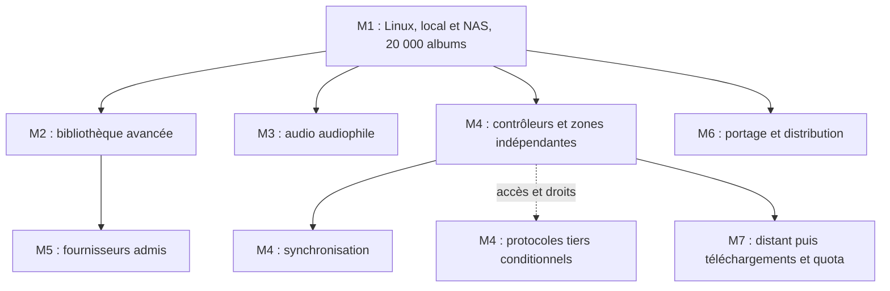

# Roadmap produit proposée

P4 organise six domaines et sept milestones de produit futur. Le [programme P1 à P5](programme.md) produit seulement le dossier documentaire. Aucun résultat produit n’est coché, aucune installation ou expérimentation applicative n’a eu lieu.

M1 commence par une tranche d’écoute réelle sur petite fixture, puis accepte le MVP seulement après validation locale et NAS à 20 000 albums et environ 3 To. Les phases suivantes détaillent une progression par parcours utilisables, sans calendrier ni estimation d’heures fictive.

## Lire les six plans

| Plan responsable | Question qu’il traite |
| --- | --- |
| [Bibliothèque et métadonnées](plans/bibliotheque-et-metadonnees.md) | Retrouver la même musique malgré réimport, copies, corrections ou changement d’emplacement. |
| [Moteur audio](plans/moteur-audio.md) | Entendre la piste réellement choisie et connaître les transformations qui atteignent la sortie. |
| [Client ordinateur](plans/client-ordinateur.md) | Trouver un album et agir sur l’écoute avec une interface réactive et compréhensible sur Linux Omarchy. |
| [Réseau et zones](plans/reseau-et-zones.md) | Piloter plusieurs sorties sans mélanger leurs files, puis synchroniser seulement les groupes compatibles. |
| [Intégrations et découverte](plans/integrations-et-decouverte.md) | Ajouter des données et écoutes externes quand leur accès est établi, avec retour permanent à la bibliothèque locale. |
| [Installation et exploitation](plans/installation-et-exploitation.md) | Retrouver des données utilisables après arrêt, mise à jour ou incident, avec des preuves reproductibles sur l’environnement déclaré. |

## Parcourir les sept milestones

| Milestone | Résultat et préalables principaux | Effort et risque relatifs proposés |
| --- | --- | --- |
| [M1. Écouter sa bibliothèque locale et NAS sur Linux](milestones/m01-mvp-local.md) | Une personne importe ses fichiers locaux et NAS, trouve un album dans 20 000 albums, écoute en gapless, modifie une playlist, redémarre et restaure ses données sans modifier les sources. | Élevés : grande bibliothèque, gapless, reprise et restauration définissent le socle. |
| [M2. Organiser éditions, classique et sélections](milestones/m02-bibliotheque-avancee.md) | Une personne corrige un coffret, distingue deux interprétations, retrouve une œuvre avec Focus, sauvegarde une sélection dynamique et exporte une copie vérifiée. | Élevés : identités, classique, corrections et critères combinés. |
| [M3. Mesurer et régler la chaîne audio](milestones/m03-audio-audiophile.md) | Une personne identifie sa sortie, examine les transformations réelles, choisit une chaîne DSP et compare le son produit aux signaux de référence. | Élevés : qualité mesurée, backend et matériel. |
| [M4. Contrôler et écouter dans plusieurs pièces](milestones/m04-reseau-domestique.md) | Deux contrôleurs autorisés pilotent des files indépendantes sur deux endpoints. Une étape suivante permet de grouper des sorties compatibles puis de les dissocier. | Élevés : concurrence puis horloges. Les tiers restent une branche conditionnelle. |
| [M5. Enrichir et découvrir selon les accès obtenus](milestones/m05-decouverte-et-integrations.md) | Une personne consulte un enrichissement attribué, reçoit une sélection puis lit un contenu autorisé. Elle peut désactiver le fournisseur et poursuivre sa bibliothèque locale. | Variables, parfois bloqués : accès et droits avant coût technique. |
| [M6. Porter, mettre à jour et exploiter](milestones/m06-desktop-et-distribution.md) | Une personne installe sur un autre desktop retenu, retrouve les mêmes données et usages, met à jour puis déplace le serveur vers un hôte compatible. | Variables selon plateformes et artefacts retenus. |
| [M7. Préparer puis valider les usages mobiles](milestones/m07-mobile.md) | Une personne accède à sa bibliothèque à distance, télécharge un fichier local autorisé, l’écoute hors réseau puis gère un quota de stockage. | Horizon de coût encore indéterminé : sécurité distante et état hors ligne. |

Ces comparaisons servent à placer les études risquées tôt. Elles ne mesurent ni charge réalisée ni délai de livraison. Les dépendances ci-dessous font autorité sur l’ordre des numéros.

## Dépendances sans chaîne artificielle

M2 et M3 divergent après M1. M4 exige autorité, identités et preuves audio utiles de M1, sans attendre tout le DSP. M5 utilise les éditions et provenance M2, sans attendre toute M4. M6 commence par les capacités M1. Le portage d’une capacité avancée ajoute sa phase validée comme dépendance avant travail. M7 utilise appairage, endpoints et persistance, sans exiger un groupe audio synchronisé.

Chaque ligne du tableau est une phase future. Les dépendances sont des liens vers les résultats préalables, sans cycle. Les conditions d’accès et décisions de conception restent aussi des critères d’entrée, détaillés dans les fichiers de milestone.

| Phase | Dépendances produit explicites |
| --- | --- |
| [M1-P01](milestones/m01-mvp-local.md#m1-p01) | Aucune. Appliquer les préconditions M1. |
| [M1-P02](milestones/m01-mvp-local.md#m1-p02) | [M1-P01](milestones/m01-mvp-local.md#m1-p01) |
| [M1-P03](milestones/m01-mvp-local.md#m1-p03) | [M1-P02](milestones/m01-mvp-local.md#m1-p02) |
| [M1-P04](milestones/m01-mvp-local.md#m1-p04) | [M1-P03](milestones/m01-mvp-local.md#m1-p03) |
| [M1-P05](milestones/m01-mvp-local.md#m1-p05) | [M1-P04](milestones/m01-mvp-local.md#m1-p04) |
| [M1-P06](milestones/m01-mvp-local.md#m1-p06) | [M1-P05](milestones/m01-mvp-local.md#m1-p05) |
| [M2-P01](milestones/m02-bibliotheque-avancee.md#m2-p01) | [M1-P06](milestones/m01-mvp-local.md#m1-p06) |
| [M2-P02](milestones/m02-bibliotheque-avancee.md#m2-p02) | [M2-P01](milestones/m02-bibliotheque-avancee.md#m2-p01) |
| [M2-P03](milestones/m02-bibliotheque-avancee.md#m2-p03) | [M2-P02](milestones/m02-bibliotheque-avancee.md#m2-p02) |
| [M2-P04](milestones/m02-bibliotheque-avancee.md#m2-p04) | [M2-P03](milestones/m02-bibliotheque-avancee.md#m2-p03) |
| [M3-P01](milestones/m03-audio-audiophile.md#m3-p01) | [M1-P06](milestones/m01-mvp-local.md#m1-p06) |
| [M3-P02](milestones/m03-audio-audiophile.md#m3-p02) | [M3-P01](milestones/m03-audio-audiophile.md#m3-p01) |
| [M3-P03](milestones/m03-audio-audiophile.md#m3-p03) | [M3-P02](milestones/m03-audio-audiophile.md#m3-p02) |
| [M3-P04](milestones/m03-audio-audiophile.md#m3-p04) | [M3-P03](milestones/m03-audio-audiophile.md#m3-p03) |
| [M4-P01](milestones/m04-reseau-domestique.md#m4-p01) | [M1-P06](milestones/m01-mvp-local.md#m1-p06) |
| [M4-P02](milestones/m04-reseau-domestique.md#m4-p02) | [M4-P01](milestones/m04-reseau-domestique.md#m4-p01), [M1-P04](milestones/m01-mvp-local.md#m1-p04) |
| [M4-P03](milestones/m04-reseau-domestique.md#m4-p03) | [M4-P02](milestones/m04-reseau-domestique.md#m4-p02) |
| [M4-P04](milestones/m04-reseau-domestique.md#m4-p04) | [M4-P02](milestones/m04-reseau-domestique.md#m4-p02) |
| [M5-P01](milestones/m05-decouverte-et-integrations.md#m5-p01) | [M2-P02](milestones/m02-bibliotheque-avancee.md#m2-p02) |
| [M5-P02](milestones/m05-decouverte-et-integrations.md#m5-p02) | [M5-P01](milestones/m05-decouverte-et-integrations.md#m5-p01), [M2-P02](milestones/m02-bibliotheque-avancee.md#m2-p02) |
| [M5-P03](milestones/m05-decouverte-et-integrations.md#m5-p03) | [M5-P02](milestones/m05-decouverte-et-integrations.md#m5-p02), [M2-P03](milestones/m02-bibliotheque-avancee.md#m2-p03) |
| [M5-P04](milestones/m05-decouverte-et-integrations.md#m5-p04) | [M5-P02](milestones/m05-decouverte-et-integrations.md#m5-p02), [M2-P04](milestones/m02-bibliotheque-avancee.md#m2-p04), [M1-P04](milestones/m01-mvp-local.md#m1-p04) |
| [M6-P01](milestones/m06-desktop-et-distribution.md#m6-p01) | [M1-P06](milestones/m01-mvp-local.md#m1-p06) |
| [M6-P02](milestones/m06-desktop-et-distribution.md#m6-p02) | [M6-P01](milestones/m06-desktop-et-distribution.md#m6-p01), [M1-P05](milestones/m01-mvp-local.md#m1-p05) |
| [M6-P03](milestones/m06-desktop-et-distribution.md#m6-p03) | [M6-P02](milestones/m06-desktop-et-distribution.md#m6-p02), [M1-P06](milestones/m01-mvp-local.md#m1-p06) |
| [M7-P01](milestones/m07-mobile.md#m7-p01) | [M4-P01](milestones/m04-reseau-domestique.md#m4-p01), [M4-P02](milestones/m04-reseau-domestique.md#m4-p02), [M1-P05](milestones/m01-mvp-local.md#m1-p05) |
| [M7-P02](milestones/m07-mobile.md#m7-p02) | [M7-P01](milestones/m07-mobile.md#m7-p01) |
| [M7-P03](milestones/m07-mobile.md#m7-p03) | [M7-P02](milestones/m07-mobile.md#m7-p02) |

## Conserver couverture et preuves

[Couverture TSV](couverture.tsv) relie les 195 fonctions, avec un seul responsable chacune, aux phases et [50 scénarios](validation.md). Les chemins de `plan`, `phase` et `scenario` sont relatifs au répertoire `docs`. La colonne `milestone` conserve exactement M1 à M7 du registre. Les scénarios recopient le cas `validation_future` propre à chaque fonction et ajoutent protocole, résultat, métrique et artefact attendu.

Le rattachement à un plan précise une responsabilité de P4. Il ne modifie pas la colonne conceptuelle `responsable_kuro` de P2. Par exemple, les raccourcis et l’accessibilité reviennent au client, la disponibilité NAS à la bibliothèque et l’autorisation de contrôleurs au réseau, avec exploitation comme collaborateur. D15 relève du plan client comme horizon, sans imposer le desktop au mobile.

`retenu_provisoire`, `proposition`, `conditionnel` et `reporte` restent leurs statuts P2. En M4 et M5, un fournisseur ou protocole inaccessible reçoit un blocage motivé, tandis que les parcours indépendants restent livrables. Aucune obligation socle ne peut être retirée par cette règle. Toute réaffectation de milestone ou modification de cas devra être proposée avant changement du registre.

Les budgets recherche visible p95 < 300 ms et première page < 1 s de P3 restent proposés à approuver sur matériel fixé. Aucun résultat ni baseline n’est inventé. Les [décisions ouvertes P3](faisabilite.md) précisent qui choisit licence, stack, NAS, formats, état restauré et droits. Leur choix définitif précède l’adoption future, pas la rédaction de ce dossier.

## Passage et contrôle documentaire

La fin d’une phase produit future exige ses preuves de sortie et la revue des écarts. Les plans n’imposent aucun commit ou publication automatique. La fin documentaire P4 exige six plans, sept milestones, couverture complète, dépendances acycliques et liens valides, puis revue du coordinateur. La [passation P4](passations/p4-multiplan.md) contient les commandes réellement exécutées et leurs résultats. P5 contrôle ensuite cohérence et couverture indépendamment.
